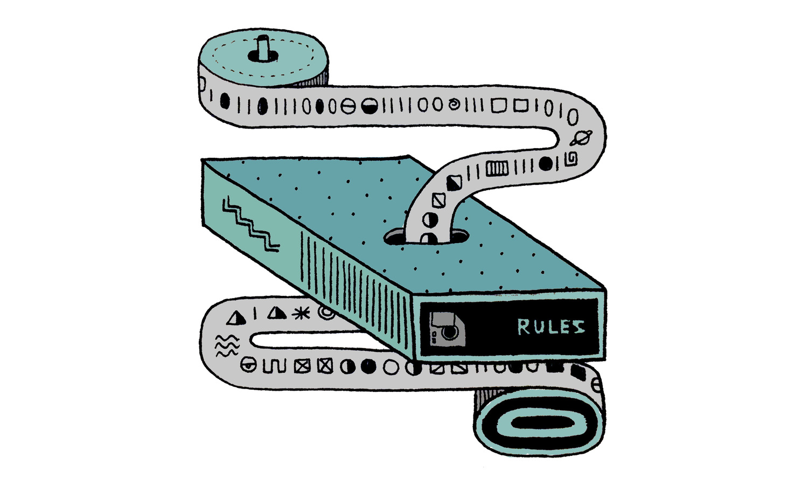

### I. Introduction

AI has been an amazing tool for programmers like me and so many others. 
We hear about different ways AI has shaped or impacted people's learning in 
various subjects like math, English, science, and many more. In my own personal 
use, I employ it for creating study guides, ensuring the grammar of essays 
I have to write for class adheres to the rubric, and much more. I will 
highlight some particular cases where I have used AI in my class, 
ICS 314 Software Engineering.

### II. Personal Experience with AI:
I have used AI in class this semester in the following areas:

  1. Experience WODs
I did not use any AI for Experience WODs since the videos provided by the
professors were already helpful in solving the issues I was facing during the
assignment. I think the only time I used AI was probably when I was looking
for the ELint error. 
  2. In-class Practice WODs
For the in-class practice WODs, I used a form of AI for all of the practice.
This happened if I had read any of the past materials or if new languages
were taught recently. I believe using AI in practice WODs helped me better
prepare for the actual WOD on Thursday since I already had the foundational
knowledge of code.
  3. In-class WODs Meteor 1
"I was fairly doing well with different languages like React and
using HTML, but I had a strong distaste for learning Meteor.
For this WOD, I also received a DNF since I didn't finish within the
given time. Looking for answers on how to solve my code with different
AI was challenging since all the suggestions were useless.
  4. Essays
In terms of essays, I haven't had to ask AI to write one for me before, but
I have used it to fix my grammar or choose the best word for a sentence.
However, I've never really asked it to complete an essay for me. Personally,
I enjoy writing, and it's easier for me to BS something and actually understand
the text I produce, since it would be awkward if my professor praised me for
an essay that I had no idea I wrote.
  5. Final project
For the final project, I haven't had to use AI since the project from my end
requires me to do the data collection of existing restaurants. For example,
I had to create individual cards with location, time, and images. I was more
focused on the customer side of things and what the user would experience,
so I couldn't use AI at all.
  6. Learning a concept / tutorial
I haven't had the chance to use AI at all
  7. Answering a question in class or in Discord
I did not get the chance to need AI for answering questions I had,
since Discord was available for me.
  8. Asking or answering a smart-question
No, since I rarely used Discord to answer my questions. What I
usually do is watch YouTube videos since I'm a visual learner.
  9. Coding example e.g. “give an example of using Underscore .pluck”
I had used AI multiple times but not for this class. I think for my other coding
classes that require a little bit more examples for me to fully understand, but for ICS 314, I haven't had an opportunity to use AI.
  10. Explaining code
AI comes in handy when I need to explain code, especially in times when we
 just learned a new way to .pluck or sort something out. I need a way to help my brain wrap around the idea.
  11. Writing code
I usually ask AI to write code for me, but not for class-related tasks. It's more for understanding how to use a certain function or creating a new class with specific parameters that I want it to do. However, I haven't had the opportunity to have it create a whole code block with different classes and functions.
  12. Documenting code
I haven't used AI for documenting code.
  13. Quality assurance 
I also didn't participate in using AI for quality assurance.
  14. Other uses in ICS 314 not listed above
When we had to make comment about someone from my group and I really wanna same something off pudding I asked AI to make it softer tone instead of a harsher tone. 

### III. Impact on Learning and Understanding:

Personally, the impact of learning and my understanding with using AI has been beneficial. It not only ensures that I pass the class, but it also allows for faster response times when asking questions. For example, during the WODs every Thursday, I would feel anxious if I didn't have the chance to use AI because I couldn't rely on Google, which often directs me to lengthy articles. However, using AI provides an answer right away. My learning has significantly improved with tools like ChatGPT, or Bards Google, among others 

### IV. Practical Applications:

A practical application of using AI would be creating a study plan for an exam in a subject where you need extra help. ChatGPT also provides links to YouTube videos if you ask for more visual understanding. When it comes to creating a study plan, I would copy and paste my calendar of all the past subjects that my professor had covered and ask ChatGPT for the best study plan before exam season comes around.

### V. Challenges and Opportunities:

I think a major challenge when facing AI is not having the right amount of patience, since AI has improved the time to find the answer to a solution. Now, every time I have to Google something, I always dread it since I have to read a whole article to understand. However, some opportunities arise from AI having vast knowledge about different programming languages. I believe for a software engineering education, this is useful since we have to learn multiple programming languages in our classes. For example, we had to learn HTML, React, Meteor, and many more. Having a useful tool like AI when you're dealing with multiple languages goes hand in hand with refreshing your memory for one of them.

### VI. Comparative Analysis:

The contrast between traditional teaching methods and AI-enhanced approaches is time. When you are preparing to study for an exam or learning new syntax for a programming language, both teaching methods are completely fine in my eyes, as they provide you with new knowledge and understanding of the topics. However, from my personal experience with coding with AI, I tend to not retain as much information as when I take the time to learn it myself. I think the speed at which you receive the information is also the speed at which it exits your brain. But I did find a balance when using AI and traditional teaching methods. When rereading my notes or lecture slides, I tend to ask AI for examples rather than the solution. When I first started doing this, I found that I had more engagement with my notes and codes, and it also improved my retention compared to the old ways. 

### VII. Future Considerations:

In my view, AI isn't going anywhere since it's fairly new. I think there are major challenges emerging now. While AI in educational settings has indeed improved people's grades, it hasn't necessarily enhanced their knowledge retention. I'm not suggesting that AI should be banned from use in homework or exams because that would be unfair. However, AI should have some limitations to better understand the student's point of view, including their individual circumstances compared to the rest of the class. If everyone is using AI, it means everyone is progressing at the same pace. Finding the balance in the use of AI and maximizing its potential is even better. The areas for improvement include ensuring that everyone has access to AI like never before. It has narrowed the learning gap between the rich and the poor. Comparing the distance learning curve of a student who has attended a well-funded school with ICS funding to someone who hasn't had any funds, AI is closing the gap. The less fortunate student has access to something free like AI to learn and catch up to the fortunate student.

### VIII. Conclusion:

In conclusion, my journey with AI throughout my education has been both enlightening and transformative. From utilizing it to enhance my understanding of coding concepts to employing it for grammar correction in essays, AI has become an indispensable tool in my learning arsenal. Despite not having the opportunity to explore its full potential in every aspect of my coursework, the instances where I did integrate AI were undoubtedly beneficial. Its ability to provide quick answers and facilitate comprehension has significantly improved my learning experience, particularly during challenging tasks like coding assignments and exam preparation.

Looking ahead, I believe AI will continue to play a pivotal role in education, bridging gaps in access to resources and leveling the playing field for students from diverse backgrounds. However, while AI offers immense potential for enhancing learning outcomes, it also presents challenges, particularly in ensuring equitable access and addressing concerns related to knowledge retention.

As AI continues to evolve, it is essential for educators and students alike to adapt to its capabilities responsibly, leveraging its benefits while also acknowledging its limitations. By striking a balance between traditional teaching methods and AI-enhanced approaches, we can create a more inclusive and effective learning environment for all. Ultimately, the integration of AI into education represents not only a technological advancement but also a step towards democratizing knowledge and fostering greater equity in learning opportunities

