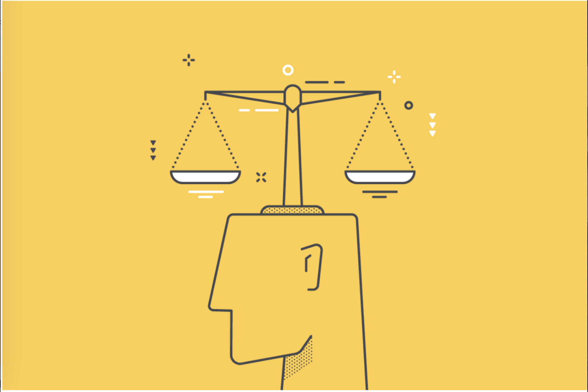

    

### I. Introduction

As I near the end of my studies in software engineering, several key concepts 
have come to mind that have helped me fully understand the essence of this
course. From topics like Agile project management, open-source software 
development, to development environments, many aspects have shaped my 
understanding. However, two things particularly stand out to me when 
reflecting on this class: Ethics in Software Engineering and Coding Standards.

As programmers, we often overlook the fact that our actions carry consequences, 
which are deeply rooted in ethics and coding standards. These principles remind
us of our responsibility to uphold ethical practices and maintain high standards
of code quality. By adhering to ethical guidelines and coding standards, we ensure 
the integrity and reliability of the software we develop, ultimately impacting 
the broader community in a positive manner.

### Ethics In The Real World vs. Computers

In one of the activities we did in class, we conducted a debate between two sides. 
The scenario involved the dilemma of hiring a newcomer to the company while denying 
a promotion to one of our long-time employees. We listened to arguments from both 
sides regarding the justification for their actions. However, these topics extend 
beyond the confines of our classroom.

Ethics are crucial when working for companies that handle valuable information, 
such as the private records of customers who use a company's services. Constantly 
considering how customers would feel, rather than solely focusing on maximizing 
company profits, is essential. This is a principle I will carry with me throughout 
my future career, always mindful of the importance of ethics. It can be challenging 
to navigate important decisions, but engaging in discussions about these decisions 
will aid in the process. Recognizing the responsibility to safeguard humanity's
well-being is imperative when faced with potentially dangerous consequences.

### Your Not The Only One

When I first joined the UH Manoa Computer Science program, there were several key 
principles they emphasized, and one of them was coding standards. Coding standards
are essentially a set of rules and guidelines that developers adhere to when 
writing code. These rules ensure consistency, readability, and maintainability 
of the codebase, which in turn facilitates problem-solving, especially when 
collaborating with others in pairs or groups.

In my software engineering class, our final project reflected the collective 
interests of the entire group. Each member tackled different aspects, with some 
focusing on research and data collection while others worked on the back-end 
and front-end of our website. Despite the diverse tasks, the adherence to coding
standards ensured smooth integration and understanding among team members. 
This cohesion was crucial in achieving our shared goal of completing the project 
efficiently. Without these standards, our project could have faced delays or 
even remained unfinished.

The ability to pass on knowledge is invaluable, as it simplifies problem-solving 
along the journey. With coding standards in place, seeking assistance or 
revisiting past work becomes easier, eliminating the need for extensive 
troubleshooting. This not only benefits collaboration within a team but also 
aids individual developers in maintaining continuity and efficiency in their work.

