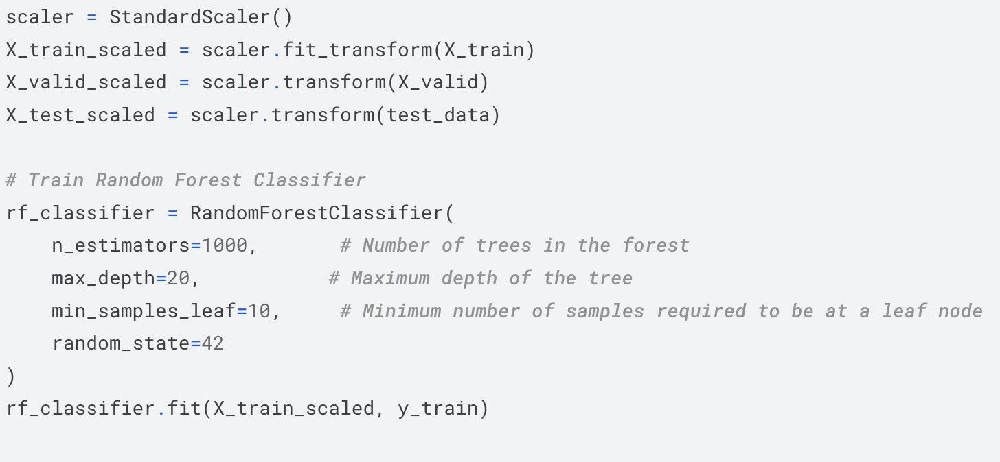

In the competition, we were tasked with distinguishing between two event classes: those that produce the exotic Higgs Boson particle and those that do not. Our dataset comprised 28 features describing the trajectories of decay particles, sourced from the ATLAS detector at the Large Hadron Collider at CERN, located near Geneva, Switzerland.

Our primary objective was to employ a machine learning classifier to train on simulation and calibration data, categorizing the data into these two distinct events. In pursuit of this goal, I opted for a Random Forest Classifier due to its ability to handle a multitude of features and to identify the most impactful features among random subsets. Initially, my classifier yielded an accuracy score of 0.60, which subsequently increased to 0.69.

An interesting observation emerged during the experimentation phase: adjustments to the parameters of the Random Forest Classifier significantly influenced the accuracy scores. Specifically, increasing the number of estimators (n_estimators) from 300 to 1000, raising the maximum depth (max_depth) from 10 to 20, and augmenting the minimum samples per leaf (min_samples_leaf) from 4 to 10 resulted in a notable accuracy improvement, elevating it from 0.69 to 0.79.

From this project, I gleaned the importance of parameter tuning in enhancing the performance of machine learning models. Moreover, it underscored the significance of feature selection in discerning meaningful patterns within complex datasets. Ultimately, this experience highlighted the iterative nature of model refinement and the necessity of meticulous experimentation to achieve optimal results.

